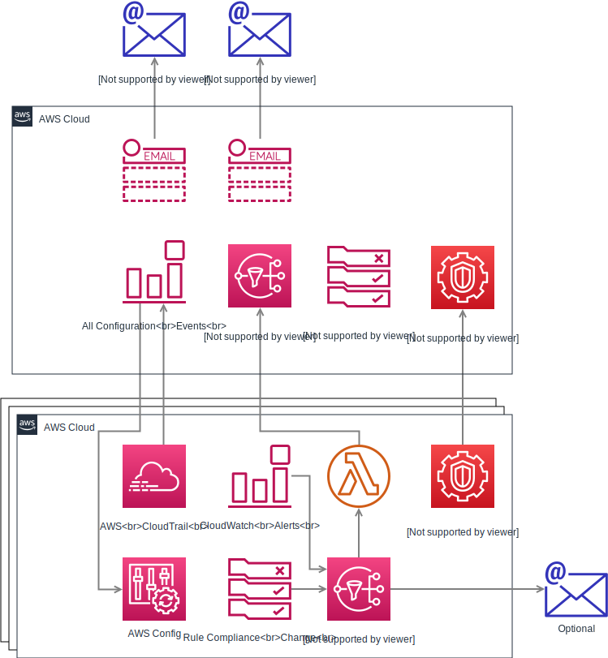
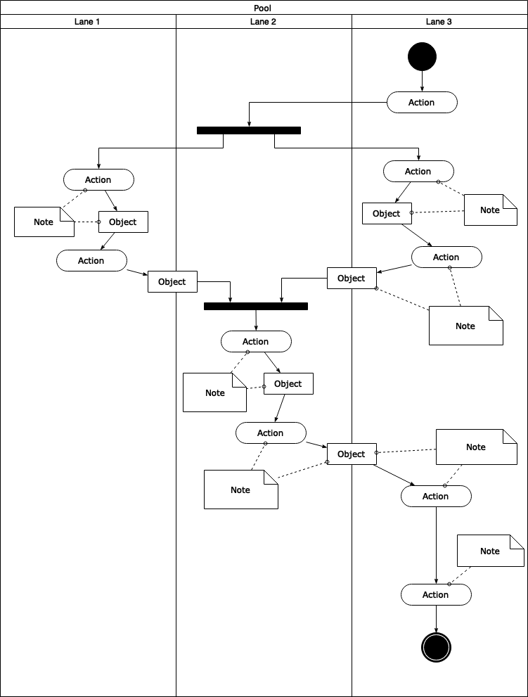
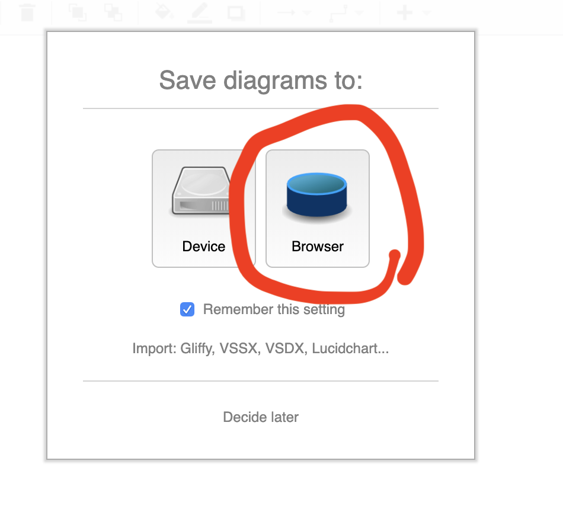
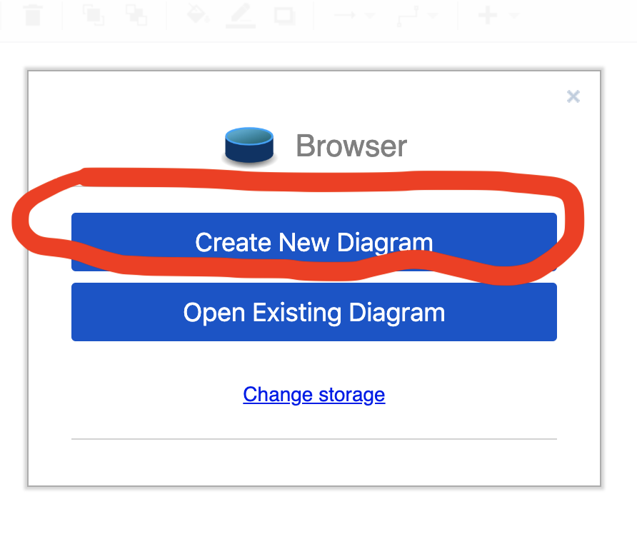
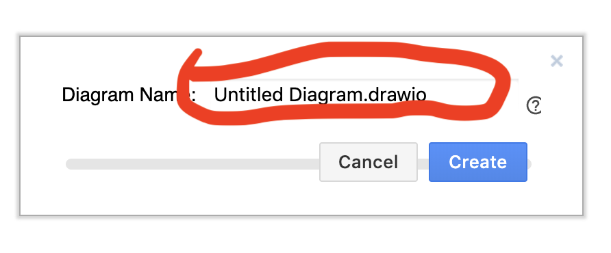
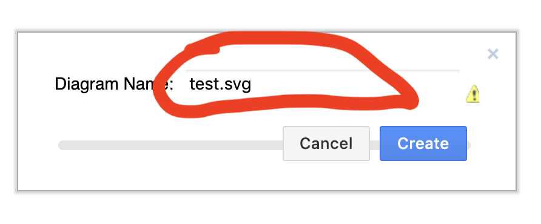
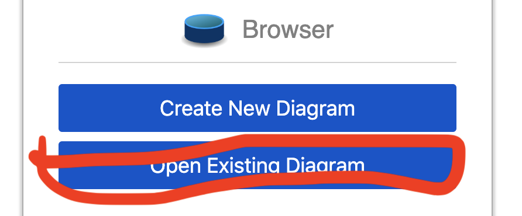

# DRAWIO For Markdown

It's not nice to draw in Markdown, try this tool to seamlessly integrate the best-used online drawing tools DrawIO and Markdown, keep documents up and running, support offline mode, and disconnect it. Supports synchronous previews and document generation, enjoy smooth graphic markdown bar. any question please to https://github.com/zhfjyq/vscode-plugin-drawio .
If it can help you , don't forget to give a star at the above address.


# DEMO

- sample-1
  

- sample-2
  

- sample-3
  

# 提示

- DrawIO is not a general-purpose SVG editor. It is an online flow chart software similar to Visio. The most powerful online software I have seen, with the most templates and the smoothest operation, the only problem is that the domestic network is a little slow, which is why the default is "offline mode".
- DrawIO default file format is XXX.drawio, but this format can not be directly embedded in markdown, so it is necessary to change the file name to XXX.svg. Powerful drawio can be automatically saved as SVG file with embedded editing information according to the file name type, and can be previewed directly in markdown.
- In order to achieve automatic file modification and storage (it's annoying to save files every time), this plug-in communicates with the browser window through chrome debugger interface, so you need to store the files in browser, that is, to select the storage location is to select the local browser.
- Every time you click on the icon to open the browser, you synchronize all saved files of drawio_assets/in the same directory of the current markdown file to the browser. You can choose to find these files from the browser's open function in drawio. Of course, the quicker way is to move the cursor to your image reference link in the markdown editor, and then click on the icon or Ctrl+P, so you can find the files from the browser. Move open the reference file under the cursor.
- In order not to interfere with each other, this plug-in creates a browser's independent running environment. The directory is in the. drawio-chrome folder under the project root directory opened by vscode. If you use git, it is strongly recommended that you add it to the. gitignore file.

# Online mode and offline mode

Draio's offline mode provides basic functionality (already powerful), if you want to use the online version (providing more templates, components and locate language), you just need to delete "offline = 1" in the address bar of the open browser window to start the online version.

# usage

## create new

1. install plugin
2. open markdown file
3. press the icon in toolbar
4. wait moment to open drawio
5. select "browser" , create new
   
   
6. modify the ext name,from .drawio to .svg
   
   
7. you can see this file in sub dir "drawio_assets" at you markdown file,,vscode have a notice for update save.
8. insert svg to markdown [stand method]

```

```

## open existed

1. open markdown file
2. select save place: :"browser"
   
3. you can see all file in you "drawio_assets" dir
   

## QUICK to open file

first,move you cursor in markdown editor to line of you want open drawio file links, then press icon, it can open the drawio file direct.

enjoy!!
